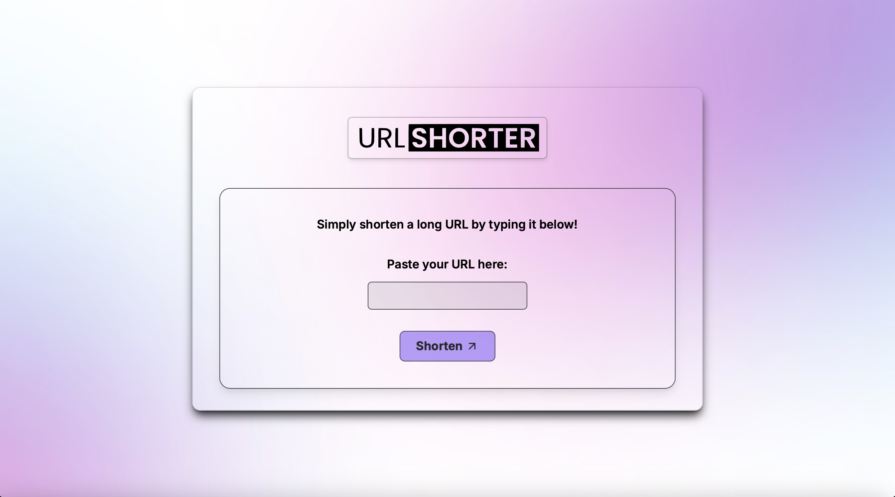

<h1 align="center">FW7 development challenge</h1>

<p align="center">
  
</p>

## 🖥️ Project

Project developed as a technical test to a Fullstack position at FW7.

## 🚀 Technologies
The project was developed using the following technologies:
- Next.js 
- TailwindCSS
- TypeScript
- Node.js
- Fastify as a framework for the backend
- Prisma ORM to create the SQLite database

## 🛠️ Installation

Use the package manager [npm](https://www.npmjs.com/) or [pnpm](https://pnpm.io/pt/) to install the project dependencies.

## 🐾 Steps
Enter the backend folder of the project and run the following command:

```bash
npm install
pnpm install
```
Then run the following command to create the database migration:
```bash 
npx prisma migrate dev
```

Then run the command to start your server:
```bash
npm run dev
pnpm run dev
```

Make sure your environment variables are correct (you can check how it's done in the `.env.example` file)


## 🔖 Layout
The project layout was developed thinking on the best for user experience and aiming at the main goal of the application.